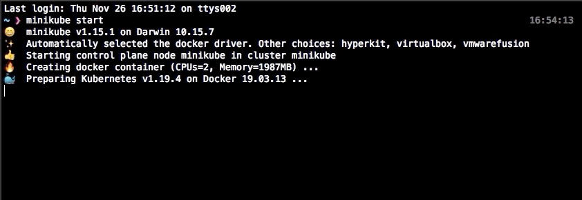

# SETUP

### Prerequisites:
- Helm3
- Minikube
- Kubectl
- Docker

### Guide

First install Helm 3
https://helm.sh/docs/intro/install/

Second install Docker
https://docs.docker.com/get-docker/

Third install Minikube along with a hypervisor
https://minikube.sigs.k8s.io/docs/start/
https://minikube.sigs.k8s.io/docs/drivers/hyperkit/

Starting Minikube

<p align="center">
  
</p>


Forth proceed with this guide in order to install CockroachDB on Minikube, remember to select the INSECURE version of the guide and use Helm to do so.
https://www.cockroachlabs.com/docs/v20.2/orchestrate-a-local-cluster-with-kubernetes-insecure

When CockroachDB is up and running (takes ~2 minutes) you can now spin up the Pythonapp pod in Minikube.
```
$ kubectl apply -f pythonapp.yaml

$ kubectl exec -ti userdb-installer -- bash
```
Setup the database and table (here you're expected to be inside the container). Run the script 2 times, first press 1 in order to create the database and table, and second time press 2 to write-out the users into a file as well as delete them from the database.
```
$ python3 usersql.py #(press 1)

$ python3 usersql.py #(press 2)

$ cat userfile.txt #confirm the users are there.
```
Now start another deployment to check if the users have been removed from the DB. When you applied the helm chart to Minikube a post-deployment output mentioned something along the lines of:
```
$ kubectl run -it --rm cockroach-client \                                                                                                        
        --image=cockroachdb/cockroach \
        --restart=Never \
        --command -- \
        ./cockroach sql --insecure --host=cockroachdb-public.default
```
Fire it up and try to select users from the humans.users table (below expects you to be inside the CockroachDB Client container
```
$ SELECT * FROM humans.users
```
The database should show be empty.

### Thoughts and improvements:
- Bulk operations: SQL: insert, delete. File: Bulk insert.
- Better Optimized Select query.
- Setup CockroachDB with SSL and create a user with least priviledged access.
- In general better code structure.
